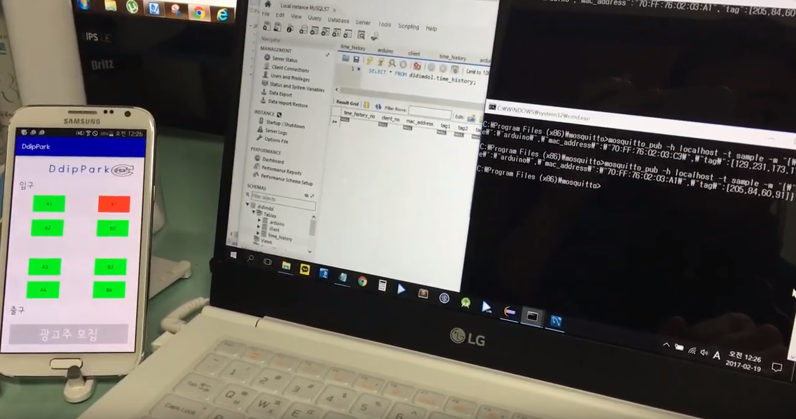
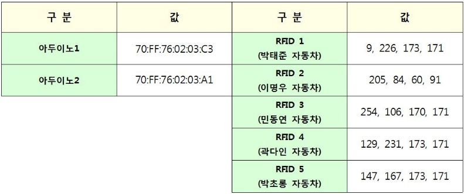
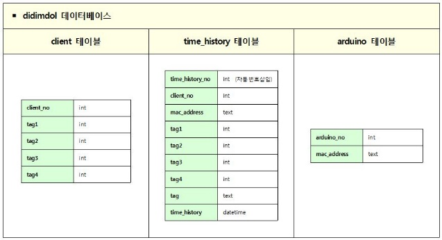
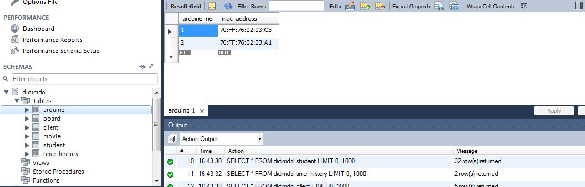
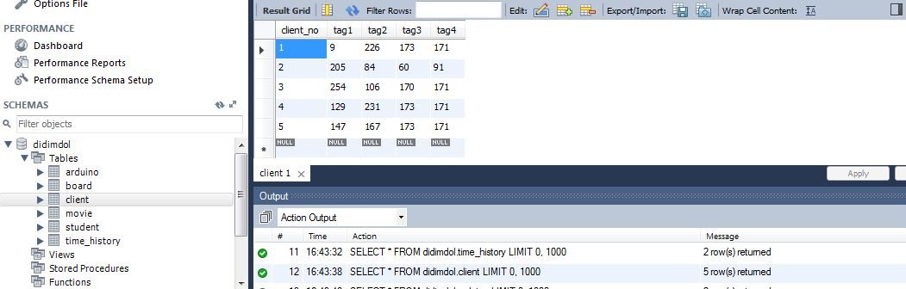
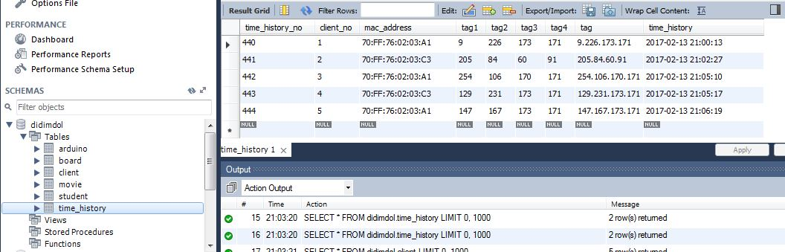
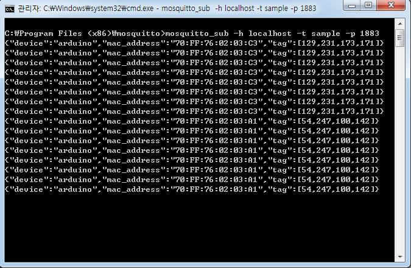

# Smart Parking System
- 아두이노를 이용한 스마트 주차 관리 시스템 입니다.
- 이 프로젝트는 `SK 고용디딤돌 3기 취업연계 직무교육과정`에서 진행했던 팀 프로젝트입니다.

   

## 프로젝트 소개
- #### [기간]
  - 2017.01.02 ~ 2017.02.10

 

- #### [역할]
  - 안드로이드 개발
  - Database 설계 및 관리

 

- #### [설명]
  - 아두이노의 RFID 센서에 RFID 카드가 부착되면 MQTT 통신을 통해 Wifi 쉴드가 웹서버로 신호를 전송

  

- #### [동작 원리 및 시연 영상]
  - **[동작 원리]**
    - (1) 아두이노의 RFID 센서에 RFID 카드가 부착되면 MQTT 통신을 통해 Wifi 쉴드가 웹서버로 신호를 전송
    - (2) 웹서버와 연결되어 있는 데이터베이스에는 RFID 부착에 관한 데이터가 저장
    - (3) 안드로이드 기기는 AsyncTask를 이용해 웹서버와 네트워크 통신을 통해 해당 정보를 수신
  - **[시연 영상]**
    - **(아래 이미지 클릭)**
    

  

- #### [프로젝트 시뮬레이션 영상]
  - **[특징]**
    - 주차장에 주차가 되어있는지 여부를 어플리케이션으로 통해 확인할 수 있습니다.
    - 실제 RFID 장비의 가격 문제로 인해 아두이노 RFID 센서를 사용하였습니다.
  - **[시뮬레이션 영상]**
    - **(아래 이미지 클릭)**
      

  

- #### [Arduino 및 RFID]
  

  

 

  

- #### [Database 테이블]
  

 

- **[arduino table]**

     

- **[client table]**

 

- **[time_history table]**

  

- #### [MQTT 통신]

    